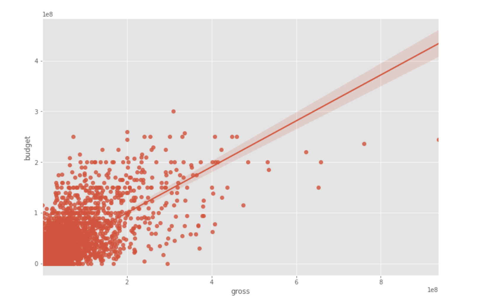
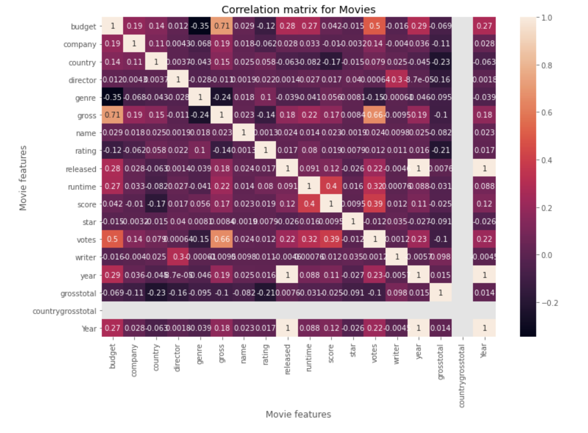

# 🎬 Movie Analysis Project

This repository contains my Python project for exploring relationships between movie features and box office performance. Using **Pandas**, **NumPy**, **Seaborn**, and **Matplotlib**, I cleaned, explored, and visualised the dataset to identify which factors are most associated with movie revenue.

---

## 📌 Introduction

This project focuses on exploratory data analysis (EDA) of a movie dataset using Python. The aim is to understand how different movie attributes, such as **budget**, **gross revenue**, **score**, **votes**, and **company**, relate to financial success.

The analysis combines data cleaning, summary statistics, correlation analysis, and visualisation to uncover patterns in the movie industry.

---

## 💡 Motivation

Movie datasets contain both numeric and categorical variables, making them a strong example for exploratory data analysis. This project was designed to investigate which features appear most related to a film’s box office performance.

The main questions explored include:

- Does a larger budget lead to higher gross revenue?
- Is movie score strongly associated with revenue?
- Which production companies generate the most gross revenue?
- Which variables are most strongly correlated with box office success?

---

## 📂 Dataset Description

The project uses a CSV file:

- `movies.csv`

The dataset includes movie-related information such as:

- `budget`
- `gross`
- `score`
- `votes`
- `company`
- `country`
- `genre`
- `director`
- `writer`
- `rating`
- `released`
- `runtime`
- `year`

These variables were used to explore financial and statistical relationships across the movie dataset.

---

## 🧪 Tools and Libraries Used

This project was built using:

- **Python**
- **Pandas**
- **NumPy**
- **Seaborn**
- **Matplotlib**

These libraries were used for data inspection, cleaning, transformation, grouping, correlation analysis, and visualisation.

---

## 🧹 Data Preparation

Before the analysis, I performed several cleaning and preparation steps, including:

- checking for missing values
- reviewing data types
- removing duplicate rows
- sorting movies by gross revenue
- converting categorical variables into numeric codes for broader correlation analysis
- extracting year-related information for additional comparison

These steps made the dataset more suitable for analysis and visualisation.

---

## 🔍 Analysis Workflow

The notebook follows a structured EDA process:

### 1. Inspect the raw data
The dataset was loaded and previewed to understand its structure and columns.

### 2. Check missing values
I calculated the percentage of missing values in each column to identify data quality issues.

### 3. Review data types
I examined numeric and categorical columns to decide which features could be used directly in correlation analysis.

### 4. Check duplicates
Duplicate rows were identified and removed.

### 5. Explore relationships between key variables
Scatter plots and regression plots were used to compare:

- `budget` vs `gross`
- `score` vs `gross`

### 6. Correlation analysis
I created correlation matrices using numeric columns and later expanded the analysis by encoding categorical variables.

### 7. Company-level analysis
The data was grouped by company to identify which production companies generated the most total gross revenue.

### 8. Additional feature comparisons
Additional plots were used to compare revenue against variables such as rating and other encoded features.

---

## 📊 Key Visualisations

### 1. Budget vs Gross Revenue



This regression plot shows a clear positive relationship between **gross revenue** and **budget**. Movies with larger budgets tend to generate higher box office revenue, suggesting that budget is one of the strongest predictors of commercial performance in this dataset.

### 2. Correlation Heatmap



This heatmap summarizes the relationships between movie features after encoding categorical variables. The strongest positive correlation appears between **budget** and **gross**, while other variables such as **votes** also show meaningful relationships with revenue. This provides a broader view of which features are most associated with movie success.

---

## 📈 Main Insights

The analysis suggests several key findings:

- **budget** has a strong positive relationship with **gross revenue**
- **votes** also show a meaningful positive relationship with gross revenue
- **score** is less strongly related to gross than budget
- some production **companies** generate substantially more total revenue than others
- correlation analysis helps confirm that financial variables are more strongly associated with revenue than many categorical features

Overall, the project suggests that **budget** is one of the most influential variables linked to a movie’s gross earnings.

---

## 🛠️ Techniques Used

This project demonstrates the use of:

- `read_csv()`
- `info()`
- `describe()`
- `isnull().sum()`
- `sort_values()`
- `drop_duplicates()`
- `groupby()`
- `sum()`
- `corr()`
- `factorize()`
- categorical encoding with `.cat.codes`
- Seaborn regression plots
- Seaborn heatmaps
- Matplotlib charts

---

## 📁 Files

- `Movie Analysis Project.ipynb` – Jupyter notebook containing the full analysis workflow
- `movies.csv` – source dataset used in the project
- `Reg_plot.png` – regression plot of budget vs gross revenue
- `Heat_map.png` – correlation heatmap of movie features

---

## ▶️ How to Run the Project

1. Open the notebook in **Jupyter Notebook**, **JupyterLab**, or **VS Code**
2. Make sure `movies.csv` is in the same working directory
3. Install the required libraries if needed:

```python
pip install pandas numpy seaborn matplotlib
